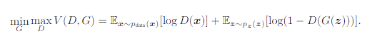

# GAN

> Generative Adversarial Networks
- Adversarial Network는 적대적인 신경망이 서로 경쟁하면서 가짜 모델의 성능을 개선한다

## 개념

>지폐위조범(Generator)은 경찰을 최대한 열심히 속이려고 하고 다른 한편에서는 경찰(Discriminator)이 이렇게 위조된 지폐를 진짜와 감별하려고(Classify) 노력한다.
이런 경쟁 속에서 두 그룹 모두 속이고 구별하는 서로의 능력이 발전하게 되고 결과적으로는 진짜 지폐와 위조 지폐를 구별할 수 없을 정도(구별할 확률 pd=0.5)에 이른다는 것.

- Discriminator는 진짜 이미지를 진짜(1)로, 가짜를 가짜(0)로 구분하도록 학습한다. 
- 반대로, Generater(Neural Network)는 랜덤한 코드를 통해서 이미지를 생성하며, Discriminator를 속여 가짜 이미지를 진짜처럼 만드는 게 목표이다. 즉, 실제 데이터의 분포와 모델이 생성한 데이터의 분포 간의 차이를 줄이는 것이다.

 - Generative model G는 우리가 갖고 있는 data x의 distribution을 알아내려고 노력합니다. 만약 G가 정확히 data distribution을 모사할 수 있다면 거기서 뽑은 sample은 완벽히 data와 구별할 수 없겠죠.
- 한편 discriminator model D는 현재 자기가 보고 있는 sample이 training data에서 온 것(진짜)인 지 혹은 G로부터 만들어진 것인 지를 구별하여 각각의 경우에 대한 확률을 estimate합니다.

- Generator Network : 랜덤 노이즈 벡터를 입력받아 이미지를 만드는 업샘플링을 진행 
- Discriminator Network : 네트워크에 전달된 이미지가 실제인지 가짜인지를 판별

1) generative model(생성 모델), G : training data의 분포를 모사함 -> discriminative model이 구별하지 못하도록

2) discriminative model(판별모델), D : sample 데이터가 G로부터 나온 데이터가 아닌 실제 training data로부터 나온 데이터일 확률을 추정

- G를 학습하는 과정은 D가 sample 데이터가 G로부터 나온 가짜 데이터와 실제 training 데이터를 판별하는데 실수를 할 확률을 최대화하는 것.
- 이 논문(GAN)에서는 이와 같은 프레임워크를 minimax two-player game으로 표현하고 있다. ->이는 논문에서 나오는 방정식으로 확인가능
- 임의의 함수 G, D의 공간에서, G가 training 데이터 분포를 모사하게 되면서, D가 실제 training 데이터인지 G가 생성해낸 가짜 데이터인지 판별하는 확률은 1/2가 된다. (즉, 실제 데이터와 G가 생성해내는 데이터의 판별이 어려워짐)
- G와 D가 multi-layer perceptrons으로 정의된 경우, 전체 시스템은 back-propagation을 통해 학습된다

## Adversarial nets

- adversarial modeling 프레임워크는 앞서 말했듯이 가장 간단하므로, multi-layer perceptrons 모델 적용
- 학습 초반에는 G가 생성해내는 이미지는 D가 G가 생성해낸 가짜 샘플인지 실제 데이터의 샘플인지 바로 구별할 수 있을 만큼 형편없어, D(G(z))의 결과가 0에 가까움. 
- 즉, z로 부터 G가 생성해낸 이미지가 D가 판별하였을 때 바로 가짜라고 판별할 수 있다고 하는 것을 수식으로 표현한 것이다. 
- 그리고 학습이 진행될수록, G는 실제 데이터의 분포를 모사하면서 D(G(z))의 값이 1이 되도록 발전한다. 이는 G가 생성해낸 이미지가 D가 판별하였을 때 진짜라고 판별해버리는 것을 표현한 것이다.

